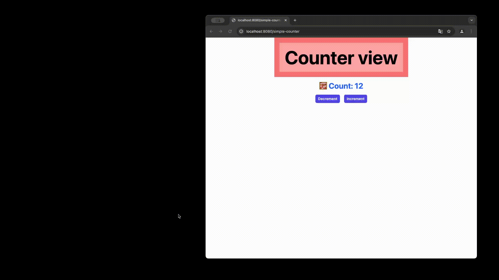
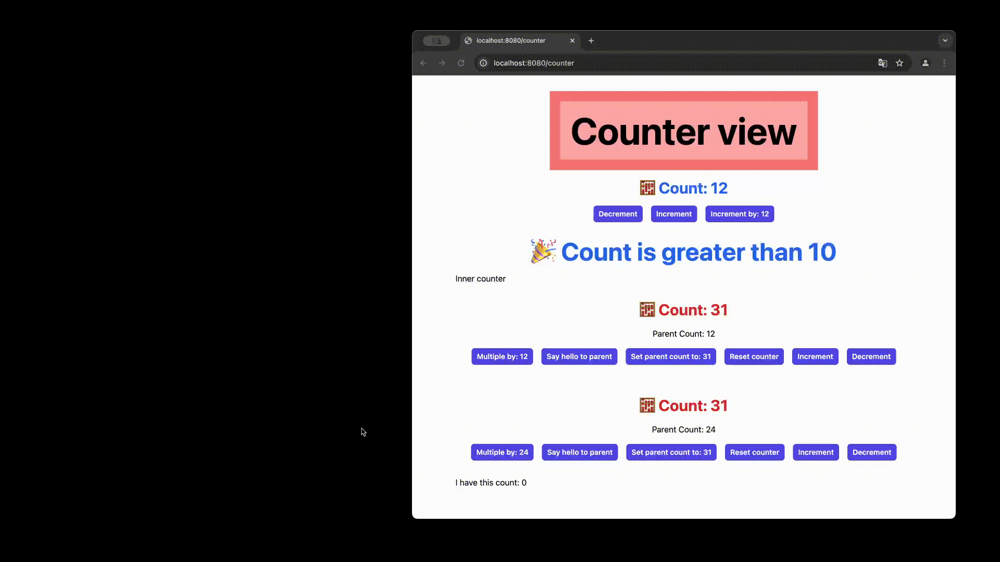
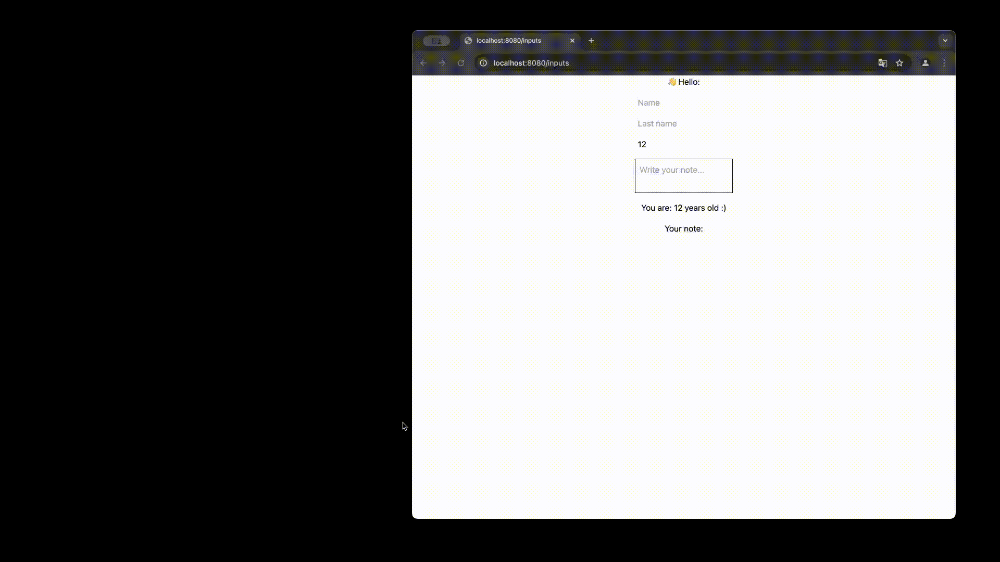

# Blaze fuse

This is a fun project which i build trying to replicate some feature from the PHP framework [Laravel](https://laravel.com/) and learn new things about web development and swift. This project is not meant to be run in production!!. Here i some feature i tried to replicate.

## Storage

I created a class which allowing to saving/uploading files to the local storage of the app. It also has a method to get the url of the file.

```swift
app.router.get("download") { request in
    guard let fileName = request.uri.queryParameters.get("fileName") else {
        throw HBHTTPError(.badRequest)
    }
    return try Storage.shared.download(path: fileName)
}

app.router.post("upload") { (request: UploadRequest) -> String in
    let result = Storage.shared.put(file: request.file, on: request.fileName)

    return "File uploaded: \(result)"
}

app.router.get("fileUrl") { request in
    guard let fileName = request.uri.queryParameters.get("fileName") else {
        throw HBHTTPError(.badRequest)
    }

    return Storage.shared.url(path: fileName)?.absoluteString
}
```

## Route Model Binding

I created an extension to the `HBRouterBuilder` which allows to bind a request body to a model.

```swift
app.router.post("login") { request: LoginRequest in
    return "Hello \(request.email)"
}
```

## Eva UI

This is the most interesting part of the project. I created a simple UI framework which allows to create UI components in a declarative way and manage the state of the components on the server side completely in Swift. Here is a example of simple counter component.

```swift
import Foundation

final class SimpleCounterView: Component<SimpleCounterView.Props> {

   // Props is a struct which holds the data that the component gets from the parent component
    struct Props: Codable {}

    // Action is a enum which holds the actions that the component can take
    enum Action: Codable {

        case increment
        case decrement

    }

    // State is a struct which holds the data that the component uses to render the view
    struct State: StateType {

        var count: Int

    }

    // This method is called when the component is mounted
    func onMount(props: Props) -> State {
        State(count: 12)
    }

    // This method is called when the action is triggered by the component. It returns the new state of the component.
    func mutate(props: Props, state: State, action: Action) async -> State {
        var state = state

        switch action {
        case .increment:
            state.count += 1

        case .decrement:
            state.count -= 1
        }

        return state
    }

    // This method is called when the state of the component is changed. It returns the view of the component.
    func render(props: Props, state: State) -> some View {
        VStack {
            Text("Counter view")
                .font(.extraLargeTitle2)
                .padding(20)
                .backgoundColor(.red300)
                .padding(20)
                .backgoundColor(.red400)

            Text("🧮 Count: \(state.count.description)")
                .font(.title2)
                .foregroundColor(.blue600)

            HStack {
                Button(onClick: .trigger(Action.decrement)) {
                    Text("Decrement")
                }

                Button(onClick: .trigger(Action.increment)) {
                    Text("Increment")
                }
            }
        }
    }

}
```

## Examples




